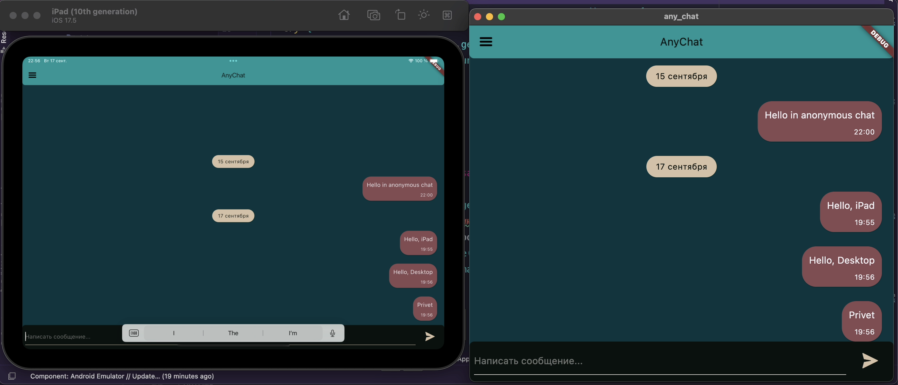

**AnyChat**
-----------------

## **About App**
Anonymous multiplatform chat application written in Flutter

## **Structure**
Application utilizes principles of Clean Architecture and Dependency Injection.

* **Chat** folder contains implementation of chat screen (main screen).
* **Domain** folder contains abstractions and models that are used by view models (notifiers in riverpod)
* **Data** folder contains implementations of abstractions
* **DI** folder contains declarations of dependencies and the implementation of the dependency graph itself

## **Preview**

[Full showcase](https://rutube.ru/video/private/3c009757c55e3af2d5922bee2014494d/?p=AOVyBhl9BNE3PccsgPIRuQ)

## **Stack**

<ul>
    <li>Dart 3.5.1</li>
    <li>Flutter 3.18.0</li>
    <li>Dio</li>
    <li>Riverpod</li>
    <li>GetIt</li>
    <li>FPDart</li>
    <li>L10N (Localization)</li>
</ul>

## **License**
*GNU Public License V 3.0*
